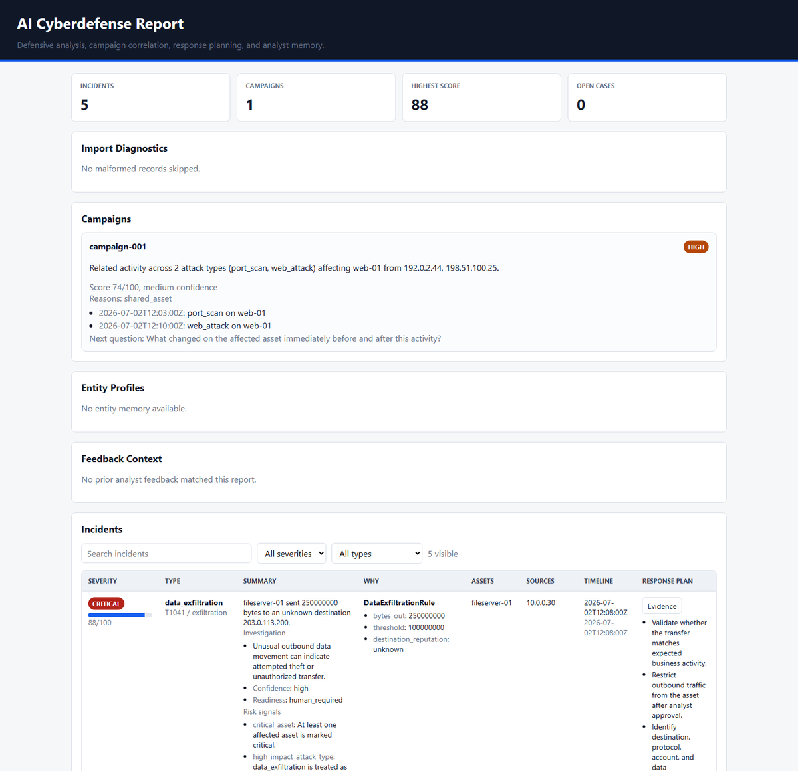
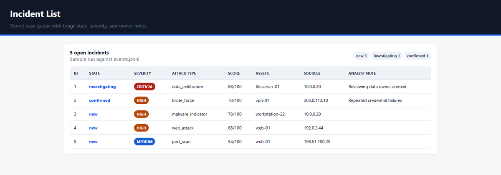
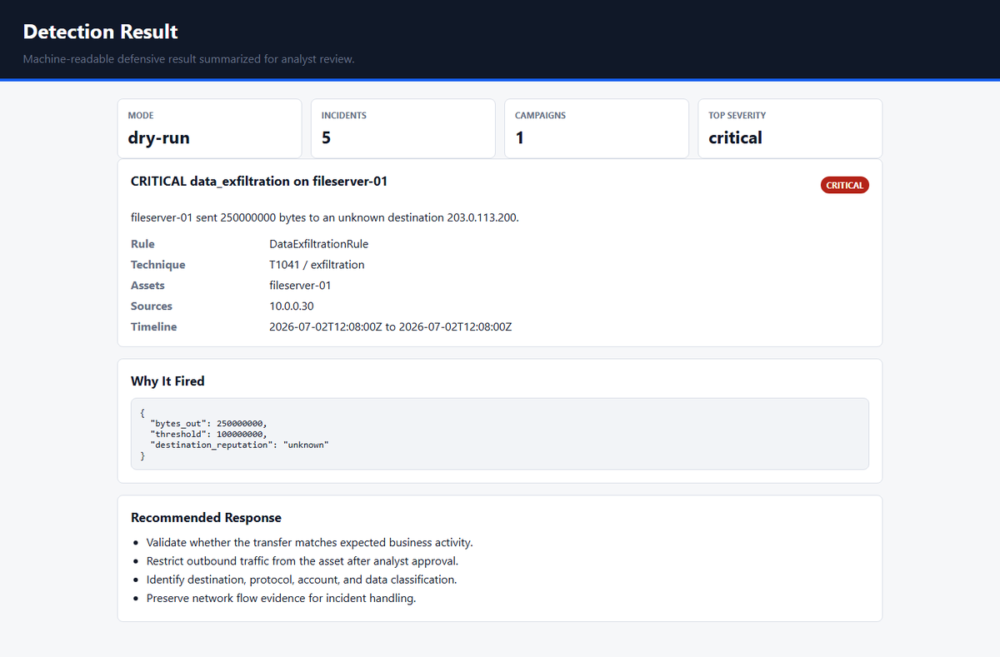
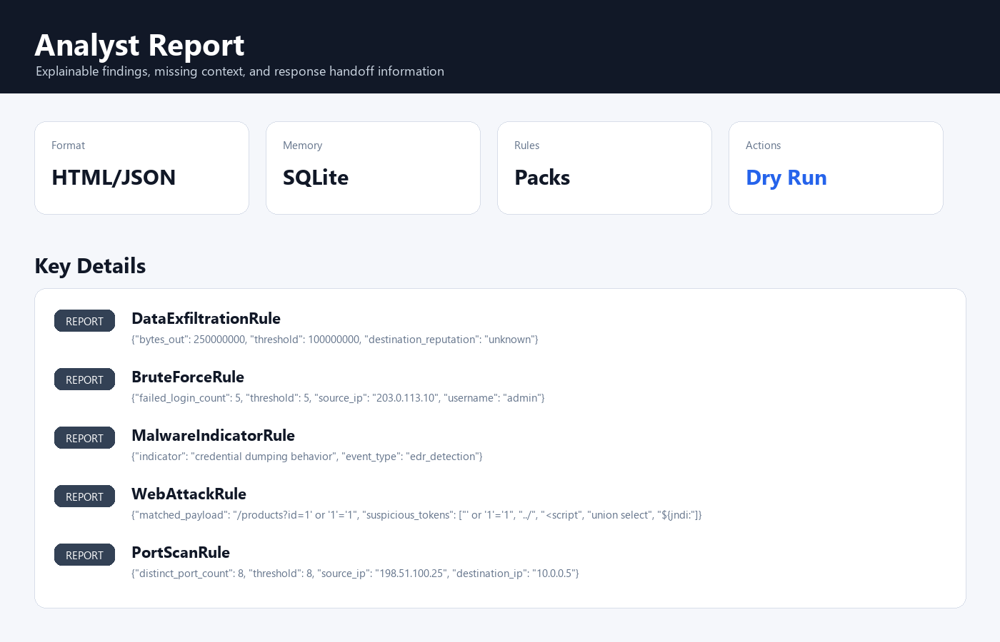
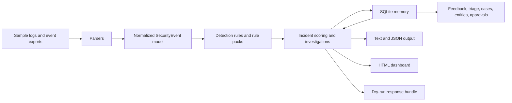

# AI Cyberdefense Agent

AI Cyberdefense Agent is a local, lab-safe SIEM/SOC-inspired portfolio project for analyzing security events, detecting suspicious activity, and producing analyst-friendly investigation output. It is the expanded successor to [Local Log Analyzer](https://github.com/Veggis96/local-log-analyzer), with dry-run response planning by default.

The project demonstrates Python CLI development, event parsing, normalized security events, rule-based detection, incident scoring, SQLite persistence, reporting, and security workflow design.

## Project Origins

AI-Cyberdefense grew from an earlier mini-project called [Local Log Analyzer](https://github.com/Veggis96/local-log-analyzer).

The original project focused on parsing local text logs, identifying common suspicious patterns, and generating basic security reports. AI-Cyberdefense expands those ideas into a more modular SIEM/SOC-inspired workflow with normalized security events, detection rule packs, incident scoring, MITRE ATT&CK context, triage, cases, entity history, response planning, SQLite persistence, and analyst-facing reports.

The current runtime detection logic is rule-based and heuristic. AI-assisted tooling was used during development, but the project does not depend on an AI model at runtime.

## Problem The Project Solves

Security analysts often need to normalize logs from different systems, identify high-signal activity, and explain why an alert matters. This project simulates that workflow locally without connecting to production systems or taking destructive action.

## Key Features

- Parses JSONL, CSV exports, nginx access logs, AWS CloudTrail-style events, Azure AD-style sign-ins, Okta-style events, and Microsoft 365 audit-style events.
- Normalizes events into a shared internal model.
- Detects brute force activity, port scans, malware indicators, data exfiltration, web attack probes, cloud identity signals, and suspicious Windows activity.
- Scores incidents using severity, confidence, asset criticality, memory context, and entity history.
- Maps detections to tactics and technique IDs where supported by the rule.
- Supports bundled detection rule packs for Windows, web, identity, network, and exfiltration examples.
- Stores incident memory, analyst feedback, triage state, cases, entity profiles, and approval decisions in SQLite.
- Generates text, JSON, Markdown response bundles, and static HTML dashboard reports.
- Runs in dry-run mode by default and does not block IPs, kill processes, or change firewall rules.

## Demo And Screenshots

Generate a complete local demo bundle:

```powershell
python -m cyberdefense_agent --events samples/events.jsonl --html-report reports/report.html --response-bundle reports/response.json --memory-db data/incidents.sqlite
```

The demo writes `reports/report.html`, `reports/response.json`, and `data/incidents.sqlite`.

### Dashboard

Overview of campaigns, import status, risk scoring, and active incidents.



### Incident List

Triage queue with state, severity, affected assets, sources, and analyst notes.



### Detection Details

Detection context with rule name, MITRE ATT&CK mapping, trigger values, and recommended response steps.



### Report

Generated report-style output for analyst handoff.



## Architecture



## Technology Stack

- Python 3.10+
- Standard-library CLI with `argparse`
- SQLite for local incident memory
- JSON, JSONL, CSV, YAML-style rule files, nginx-style logs
- HTML report generation
- `unittest` test suite

The project intentionally keeps runtime dependencies minimal.

## Project Structure

```text
cyberdefense_agent/         Python package and CLI implementation
cyberdefense_agent/rule_packs/
                            Bundled example detection packs
samples/                    Synthetic sample events, logs, config and rules
tests/                      Automated unittest test suite
docs/images/                README screenshots
README.md                   Project documentation
pyproject.toml              Local package metadata
```

## Prerequisites

- Python 3.10 or newer
- PowerShell, Bash, or another terminal

## Installation

From a clean clone:

```powershell
python -m venv .venv
.\.venv\Scripts\Activate.ps1
python -m pip install -e .
```

On macOS/Linux:

```bash
python3 -m venv .venv
source .venv/bin/activate
python -m pip install -e .
```

## Quick Start

Run the default sample:

```powershell
python -m cyberdefense_agent --events samples/events.jsonl
```

Machine-readable output:

```powershell
python -m cyberdefense_agent --events samples/events.jsonl --json
```

Generate an HTML report:

```powershell
python -m cyberdefense_agent --events samples/events.jsonl --html-report reports/report.html
```

Use local memory:

```powershell
python -m cyberdefense_agent --events samples/events.jsonl --memory-db data/incidents.sqlite
```

Use bundled rule packs:

```powershell
python -m cyberdefense_agent --events samples/events.jsonl --rule-pack windows --rule-pack identity
python -m cyberdefense_agent rule-pack list
python -m cyberdefense_agent rule-pack show --name windows
```

## Usage Examples

Parse nginx-style access logs:

```powershell
python -m cyberdefense_agent --events samples/nginx_access.log --format nginx
```

Parse Windows-style CSV events:

```powershell
python -m cyberdefense_agent --events samples/windows_security.csv --format csv
```

Use a baseline:

```powershell
python -m cyberdefense_agent --events samples/baseline_events.jsonl --baseline samples/baseline.json
```

Use local threat intelligence:

```powershell
python -m cyberdefense_agent --events samples/threat_intel_events.jsonl --threat-intel samples/threat_intel.json
```

Review approvals:

```powershell
python -m cyberdefense_agent approvals list --memory-db data/incidents.sqlite --state pending
```

Run continuously against a growing event file:

```powershell
python -m cyberdefense_agent watch --events samples/events.jsonl --interval 5
```

## Testing

```powershell
python -m unittest discover -s tests
```

The test suite covers CLI behavior, parsers, detection rules, custom rules, dashboards, entity memory, response export, and threat intelligence.

## Security And Privacy Considerations

- This is a defensive lab and portfolio project.
- The included sample data is synthetic and should not contain real user data or production logs.
- The tool runs in dry-run mode and does not execute firewall, endpoint, or identity-provider changes.
- SQLite files, generated reports, and real log files should not be committed if they contain sensitive information.
- Review any imported logs before sharing screenshots, reports, or JSON output publicly.

## Current Limitations

- Detection logic is rule-based and intended for learning, not a replacement for a production SIEM.
- Cloud/SaaS parsers use simplified local sample formats.
- Response actions are recommendations and approval records only.
- The project does not include authentication, multi-user access control, or production deployment hardening.

## Future Improvements

- Add more realistic sample datasets and parser fixtures.
- Add richer MITRE ATT&CK documentation per rule pack.
- Add a short demo GIF.
- Add packaging and release notes for easier installation.
- Add optional integrations for SIEM export formats while keeping dry-run behavior safe.

## What I Learned

- Designing normalized event models across different log sources.
- Building explainable detection rules and analyst-facing output.
- Using SQLite for local security workflow state.
- Balancing automation with human approval in defensive tooling.
- Writing tests around CLI behavior, parsing, scoring, reporting, and persistence.

## AI-Assisted Development

This project was developed iteratively with the support of AI-assisted development tools. I defined and refined the project goals, requirements, architecture, technology choices and functionality, while reviewing, testing and improving the resulting implementation.

## License

This project is released under the [MIT License](LICENSE).
